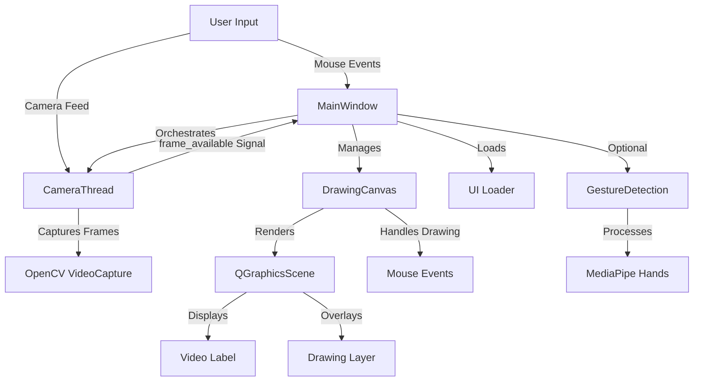

# Virtual Whiteboard


A real-time virtual whiteboard application that combines live camera feed with interactive drawing capabilities. The application overlays a transparent drawing canvas on top of the camera feed, allowing users to draw annotations while viewing the live video stream.

## Tech Stack

<div style="display: flex; align-items: center; gap: 8px; flex-wrap: wrap;">
  
  
  
</div>

- **Python 3.11/3.12** - Core programming language
- **PySide6** - Qt framework for cross-platform GUI development
- **OpenCV** - Computer vision library for camera capture and image processing
- **MediaPipe** - Machine learning framework for hand gesture detection
- **NumPy** - Numerical computing library (dependency of OpenCV and MediaPipe)
- **Docker** - Containerization for consistent deployment

## Architecture

The application follows a multi-threaded architecture using Qt's signal-slot mechanism for thread-safe communication between the camera capture thread and the main GUI thread.



## How It Works

The virtual whiteboard operates through several interconnected components working together to provide a seamless drawing experience over live camera feed.

### Camera Capture Pipeline

The `CameraThread` class extends Qt's `QThread` to handle video capture in a separate thread, preventing UI freezing during frame processing. It continuously reads frames from the default camera device using OpenCV's `VideoCapture`, flips each frame horizontally for a mirrored effect, and emits the processed frame through a Qt signal to the main thread.

### Drawing System

The `DrawingCanvas` class extends `QGraphicsView` and manages a `QGraphicsScene` that serves as the drawing surface. When the user presses the mouse button, drawing mode is activated. As the mouse moves, line segments are created between consecutive positions and added to the scene as `QGraphicsLineItem` objects. The canvas supports both pen and eraser modes, with the eraser using white color and a larger brush width to simulate erasing.

### UI Integration

The main window loads its interface from a Qt Designer UI file (`main_ui.ui`), providing a structured layout with buttons for pen, eraser, clear, and save operations. The video feed is displayed in a `QLabel` widget, while the drawing canvas is positioned as a transparent overlay on top of it. This layering approach allows drawings to appear over the camera feed without interfering with the video display.

### Gesture Detection

The application includes optional gesture detection capabilities through MediaPipe's hand tracking solution. The `GestureDetection` class processes video frames to identify hand landmarks and can be integrated for touchless drawing interactions, though the primary interface uses mouse input.

### Thread Communication

Qt's signal-slot mechanism ensures thread-safe communication between the camera thread and the main GUI thread. When a new frame is captured, the `frame_available` signal is emitted, which is connected to the `update_camera_feed` slot in the main window. This connection automatically handles thread synchronization, ensuring that GUI updates occur on the correct thread.

## Project Structure

```text
VWhiteboard/
├── main.py              # Application entry point and main window
├── whiteboard.py        # Whiteboard widget implementation
├── camera.py            # Camera thread with gesture detection
├── camera_thread.py     # Basic camera thread implementation
├── gesture.py           # MediaPipe gesture detection module
├── hand.py              # Hand tracking demonstration script
├── requirements.txt     # Python dependencies
├── Dockerfile          # Docker container configuration
├── ui/
│   ├── main_ui.ui     # Qt Designer UI file
│   └── styles.qss     # Custom stylesheet
└── README.md          # Project documentation
```

## How to Run

### Prerequisites

- Python 3.11 or 3.12 (PySide6 compatibility)
- Webcam or camera device
- Windows, Linux, or macOS operating system

### Local Installation

1. Clone the repository or navigate to the project directory.

2. Create a virtual environment (recommended):

   ```bash
   python -m venv venv
   ```

3. Activate the virtual environment:
   - Windows:

     ```bash
     venv\Scripts\activate
     ```

   - Linux/macOS:

     ```bash
     source venv/bin/activate
     ```

4. Install dependencies:

   ```bash
   pip install -r requirements.txt
   ```

5. Run the application:

   ```bash
   python main.py
   ```

### Docker Deployment

The application can be run in a Docker container with X11 forwarding for GUI display.

1. Build the Docker image:

   ```bash
   docker build -t virtual-whiteboard .
   ```

2. Run the container with X11 forwarding:

   - Linux:

     ```bash
     docker run -it --rm \
       -e DISPLAY=$DISPLAY \
       -v /tmp/.X11-unix:/tmp/.X11-unix \
       --device=/dev/video0 \
       virtual-whiteboard
     ```

   - macOS (with XQuartz):

     ```bash
     xhost +localhost
     docker run -it --rm \
       -e DISPLAY=host.docker.internal:0 \
       -v /tmp/.X11-unix:/tmp/.X11-unix \
       --device=/dev/video0 \
       virtual-whiteboard
     ```

   - Windows (with Xming or VcXsrv):

     ```bash
     docker run -it --rm \
       -e DISPLAY=host.docker.internal:0 \
       virtual-whiteboard
     ```

### Usage

Once the application launches:

- Click and drag with the mouse to draw on the canvas
- Use the "Pen" button to switch to drawing mode
- Use the "Eraser" button to erase drawings
- Click "Clear" to remove all drawings
- Click "Save" to export the drawing as an image file (PNG or JPEG)

The camera feed displays in the background, and your drawings appear as an overlay on top of it.

## License

This project is licensed under the MIT License - see the [LICENSE](LICENSE) file for details.

[](https://github.com/anfastech)
